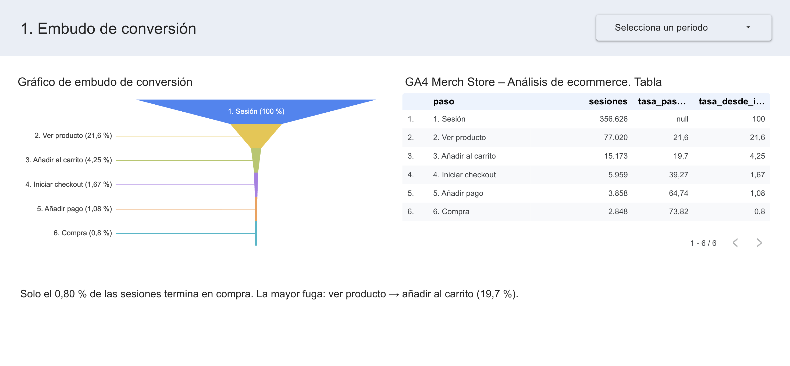
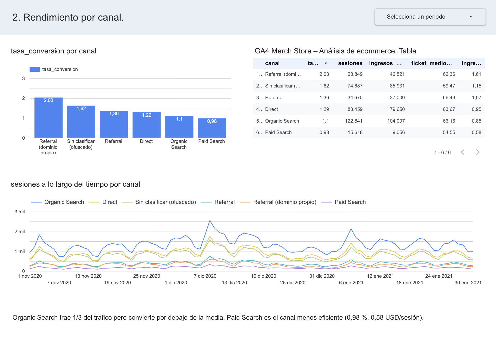
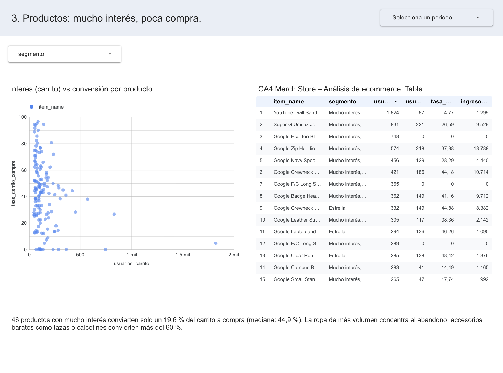
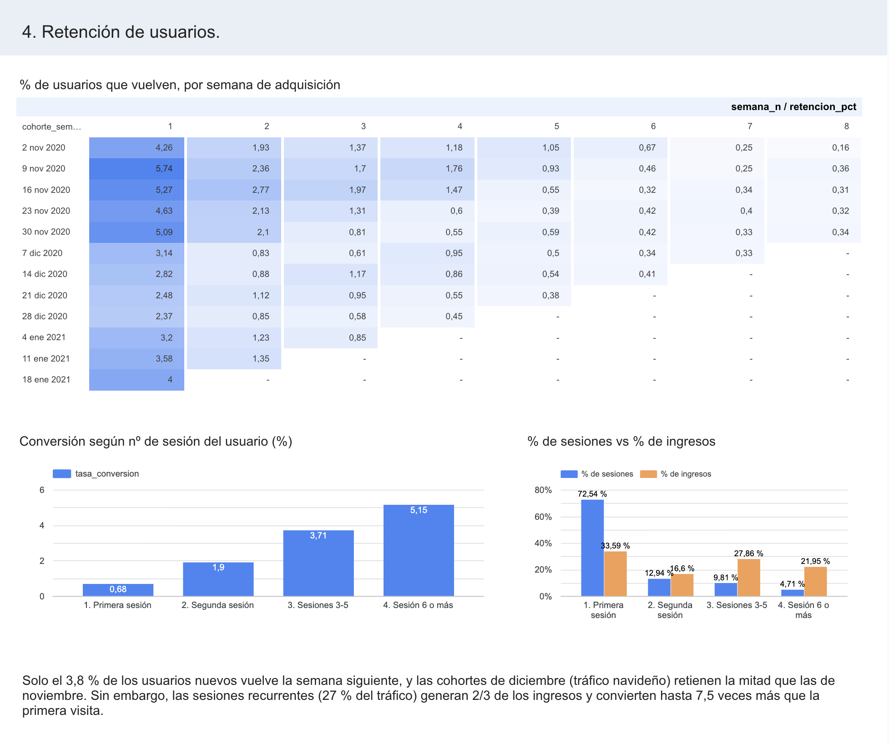

# Análisis de ecommerce con GA4 y BigQuery — Google Merchandise Store

Análisis del comportamiento de compra de la tienda online de Google (Google Merchandise Store) a partir de su export público de **Google Analytics 4 en BigQuery**, con un dashboard en **Looker Studio (Data Studio)**.

**Autor:** Enrique Núñez Rubio · Marketing & Data Analyst

**Herramientas:** BigQuery (SQL), Google Analytics 4, Looker Studio (Data Studio)

**Dashboard interactivo:** [GA4 Merch Store – Análisis de ecommerce (Data Studio)](https://datastudio.google.com/reporting/5260ff17-a383-41e0-b827-be1dad8c87b5)

---

## Resumen ejecutivo

- **La tienda convierte el 0,80 % de sus sesiones.** La mayor fuga está entre ver un producto y añadirlo al carrito: solo 1 de cada 5 sesiones que ven un producto lo añade.
- **El comprador vuelve antes de comprar.** Carrito → checkout convierte un 39 % por sesión, pero un 77 % por usuario. Las sesiones recurrentes (27 % del tráfico) generan **dos tercios de los ingresos** y su conversión multiplica por 7,6 la de la primera visita.
- **Casi nadie vuelve.** Solo el 3,8 % de los usuarios nuevos regresa la semana siguiente, y las cohortes de Navidad retienen la mitad que las de noviembre.
- **Paid Search es el canal más débil**: la conversión más baja (0,98 %), el menor ticket medio y la mitad de ingreso por sesión que Referral.
- **La ropa de más volumen concentra el abandono de carrito**, mientras que los accesorios baratos convierten por encima del 60 %.

**Recomendación principal:** invertir en recuperar al usuario (captación de email en la primera visita, carrito abandonado y remarketing), especialmente tras los picos estacionales, y revisar el rendimiento de Paid Search antes de aumentar la inversión.

---

## Contexto y datos

| | |
|---|---|
| **Fuente** | `bigquery-public-data.ga4_obfuscated_sample_ecommerce` |
| **Periodo** | 1 nov 2020 – 31 ene 2021 (92 días) |
| **Volumen** | ~4,3 M de eventos · ~267 k usuarios · ~360 k sesiones · 5.692 compras · ~362 k USD |
| **Particularidad** | Datos ofuscados por Google: valores como `<Other>` o `(data deleted)` e inconsistencias intencionadas |

## Preguntas de negocio

1. ¿Dónde se pierden los usuarios en el **embudo de conversión**?
2. ¿Qué **canales de adquisición** traen tráfico que convierte y genera ingresos?
3. ¿Qué **productos** despiertan interés pero no se compran?
4. ¿Cuántos usuarios **vuelven** y qué peso tienen en el negocio?

## Estructura del repositorio

```
├── README.md
├── sql/
│   ├── 00_data_quality_checks.sql   ← validaciones que condicionan el análisis
│   ├── 01_event_overview.sql        ← inventario de eventos
│   ├── 02_funnel.sql                ← P1: embudo cerrado por sesión
│   ├── 03_canales.sql               ← P2: rendimiento por canal
│   ├── 04_productos.sql             ← P3: interés vs compra por producto
│   └── 05_retencion.sql             ← P4: cohortes y conversión por sesión
└── images/                          ← capturas del dashboard
```

Cada script crea una tabla en el dataset `ga4_analysis`, que es la fuente del dashboard.

---

## 1. Embudo de conversión

Embudo **cerrado por sesión**: cada paso solo cuenta las sesiones que completaron también los anteriores.

| Paso | Sesiones | % vs paso anterior | % vs total |
|---|---:|---:|---:|
| Sesiones | 356.626 | – | 100 % |
| Ver producto | 77.020 | 21,6 % | 21,6 % |
| Añadir al carrito | 15.173 | **19,7 %** | 4,3 % |
| Iniciar checkout | 5.959 | **39,3 %** | 1,7 % |
| Añadir pago | 3.858 | 64,7 % | 1,1 % |
| Compra | 2.848 | 73,8 % | **0,80 %** |

**Hallazgos**
- El cuello de botella principal es **producto → carrito** (80 % de pérdida).
- **Carrito → checkout** es del 39 % por sesión pero del 77 % por usuario: una gran parte de los usuarios añade al carrito en una visita y compra en otra posterior.



## 2. Rendimiento por canal

| Canal | Sesiones | % sesiones | Conversión | Ingresos (USD) | % ingresos | Ingreso/sesión |
|---|---:|---:|---:|---:|---:|---:|
| Organic Search | 122.841 | 34,1 % | 1,10 % | 104.007 | 28,7 % | 0,85 |
| Direct | 83.459 | 23,2 % | 1,29 % | 79.650 | 22,0 % | 0,95 |
| Sin clasificar (ofuscado) | 74.687 | 20,7 % | 1,62 % | 85.931 | 23,7 % | 1,15 |
| Referral | 34.675 | 9,6 % | 1,36 % | 37.000 | 10,2 % | 1,07 |
| Referral (dominio propio) | 28.849 | 8,0 % | 2,03 % | 46.521 | 12,9 % | 1,61 |
| Paid Search | 15.618 | 4,3 % | **0,98 %** | 9.056 | 2,5 % | **0,58** |

**Hallazgos**
- **Organic Search** es el canal de más volumen, pero convierte por debajo de la media: hay margen de optimización en sus landing pages.
- **Paid Search** es el canal menos eficiente en conversión, ticket medio (54,55 USD) e ingreso por sesión.
- **Referral desde el propio dominio** (`shop.googlemerchandisestore.com`) indica un probable **problema de tracking cross-domain**: la tienda aparece como fuente de su propio tráfico.



## 3. Productos: mucho interés, poca compra

**Decisión de método.** En este dataset, los eventos `view_item` y `add_to_cart` incluyen hasta 12 productos por evento (relleno). En `add_to_cart` el producto real es el único con `quantity > 0` (64 % de los eventos); en `view_item` no existe ningún marcador fiable. Por eso se usa **añadir al carrito** como señal de interés y se mide la conversión **carrito → compra** por producto (validación en `00_data_quality_checks.sql`).

Segmentación con la mediana de productos con ≥ 50 usuarios en carrito (mediana de conversión: 44,9 %):

| Segmento | Productos | Usuarios en carrito | Compradores | Conversión |
|---|---:|---:|---:|---:|
| **Mucho interés, poca compra** | 46 | 11.938 | 2.344 | **19,6 %** |
| Estrella | 31 | 5.037 | 2.869 | 57,0 % |
| Nicho eficiente | 46 | 3.193 | 2.475 | 77,5 % |
| Bajo rendimiento | 30 | 2.170 | 581 | 26,8 % |

**Hallazgos**
- **YouTube Twill Sandwich Cap Black** es el producto más añadido al carrito (1.824 usuarios) y solo lo compra el 4,8 %.
- **Google Eco Tee Black**, **F/C Long Sleeve Tee Charcoal** y **Ash** suman cientos de usuarios en carrito y **cero compras**: hipótesis a verificar de rotura de stock o de cambio de nombre del producto.
- Los productos "Estrella" son accesorios baratos de compra por impulso: Camp Mug (80 %), Pom Beanie (72 %), Crew Socks (62 %).

**Recomendación:** revisar precio, guía de tallas y stock del top de ropa, y usar los accesorios de alta conversión como venta cruzada (cross-sell) en el carrito.



## 4. Retención de usuarios

Cohortes semanales por fecha de primer contacto (13 cohortes, 255.285 usuarios nuevos).

| Semana desde la adquisición | 1 | 2 | 3 | 4 | 8 | 12 |
|---|---:|---:|---:|---:|---:|---:|
| Retención media | **3,8 %** | 1,5 % | 1,1 % | 0,9 % | 0,3 % | 0,1 % |

- Cohortes de **noviembre**: 4,3–5,7 % de retención en la semana 1. Cohortes de **diciembre**: 2,4–3,1 %, a pesar de ser las más grandes. El tráfico navideño es de compra puntual.

**Conversión según el número de sesión del usuario**

| Sesión | % sesiones | Conversión | % ingresos |
|---|---:|---:|---:|
| 1ª | 72,5 % | 0,68 % | 33,6 % |
| 2ª | 12,9 % | 1,90 % | 16,6 % |
| 3–5 | 9,8 % | 3,71 % | 27,9 % |
| 6 o más | 4,7 % | **5,15 %** | 22,0 % |

**Hallazgo clave:** el 27 % de sesiones que son recurrentes genera el **66 % de los ingresos**. Recuperar al usuario tiene más impacto que captar más tráfico nuevo.



---

## Limitaciones

- **Canal:** el export de GA4 de 2020 solo incluye `traffic_source` (canal de **primera adquisición del usuario**), no la fuente de cada sesión. El 21 % de las sesiones no se puede clasificar por la ofuscación.
- **Productos:** las vistas por producto no son medibles (ver sección 3). Como el 36 % de los `add_to_cart` no identifica el producto, algunos artículos muestran más compradores que usuarios en carrito (tasa > 100 %); se excluyen del gráfico de dispersión del dashboard. La categoría de producto es inconsistente entre eventos.
- **Embudo:** `view_item_list` apenas se registra (71 eventos) y `add_shipping_info` se dispara a la vez que `begin_checkout`, por lo que se excluyen del embudo. El embudo cerrado deja fuera compras sin `view_item` en la misma sesión.
- **Retención:** granularidad semanal; `user_pseudo_id` depende de cookie y dispositivo, por lo que la retención real probablemente sea algo mayor.
- **Diferencias de totales:** el embudo cuenta 356.626 sesiones (solo eventos del embudo) y el análisis de canales 360.129 (todos los eventos).

## Cómo reproducirlo

1. Crea un proyecto en Google Cloud (el [BigQuery Sandbox](https://cloud.google.com/bigquery/docs/sandbox) es gratuito y no requiere tarjeta).
2. Sustituye `ga4-portfolio-enr` por el ID de tu proyecto en los scripts.
3. Ejecuta los scripts de `sql/` en orden (`02_funnel.sql` crea el dataset `ga4_analysis` en la ubicación US).
4. Conecta las tablas de `ga4_analysis` a Looker Studio (Data Studio).

> En el Sandbox las tablas caducan a los 60 días; basta con volver a ejecutar los scripts.
